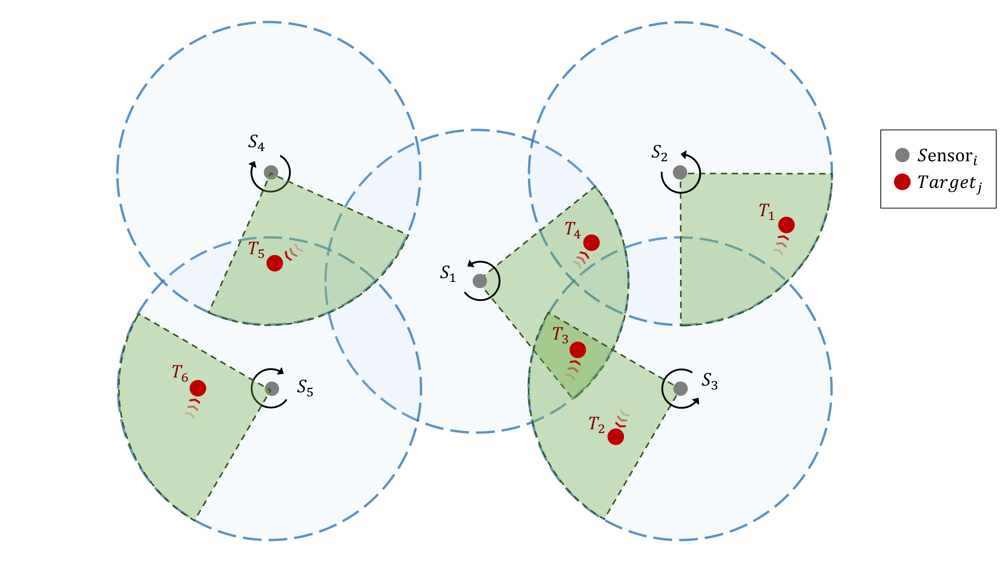

# Learning Multi-Agent Coordination for Enhancing Target Coverage in Directional Sensor Networks

This repository is the official implementation of [Learning Multi-Agent Coordination for Enhancing Target Coverage in Directional Sensor Networks](https://arxiv.org/abs/2010.13110). 


>📋  Project website: [HiT-MAC](https://sites.google.com/view/hit-mac)

## Environment
If you want to try your own algorithm in our environment, [here](https://github.com/XuJing1022/DSN) is a pure and non-hierarchical DSN environment for you.

## Requirements

To install requirements:

```setup
pip install -r requirements.txt
```

## Training
To train the executor in the paper, run this command:

```train
python main.py --env Pose-v0 --model single-att --workers 6
```

To train the coordinator in the paper, run this command:

```train
python main.py --env Pose-v1 --model multi-att-shap --workers 6
```

## Evaluation

To evaluate my model, run:

```eval
python main.py --env Pose-v1 --model multi-att-shap --workers 0 --load-coordinator-dir trainedModel/best_coordinator.pth --load-executor-dir trainedModel/best_executor.pth
```

You can use trained models directly from the folder "trainedModel".

## Contributing
If you found this work useful, please consider citing:
>📋  Pick a licence and describe how to contribute to your code repository. 
